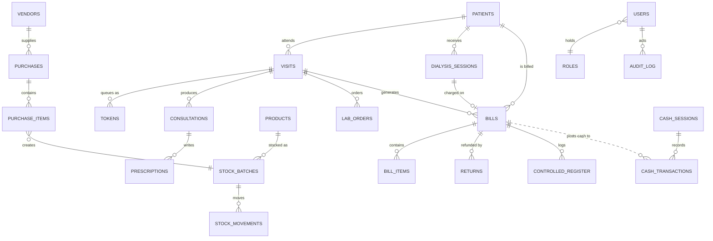
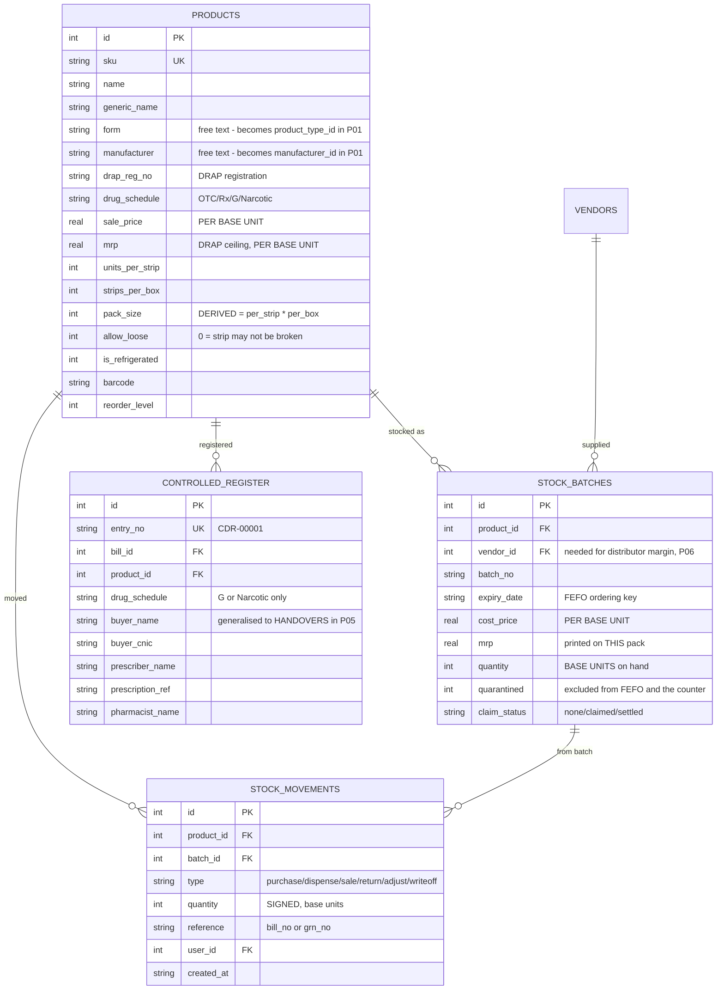
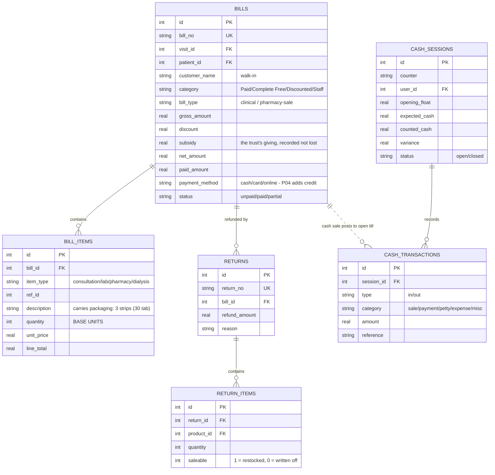
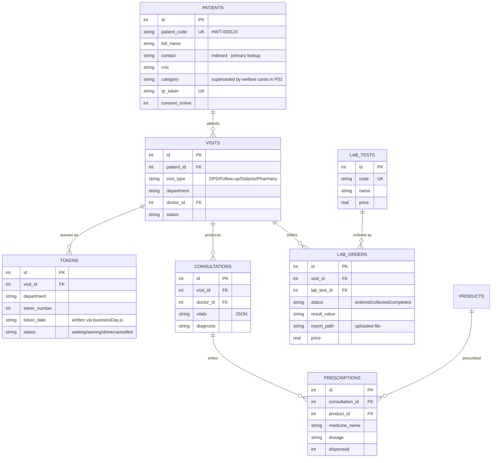
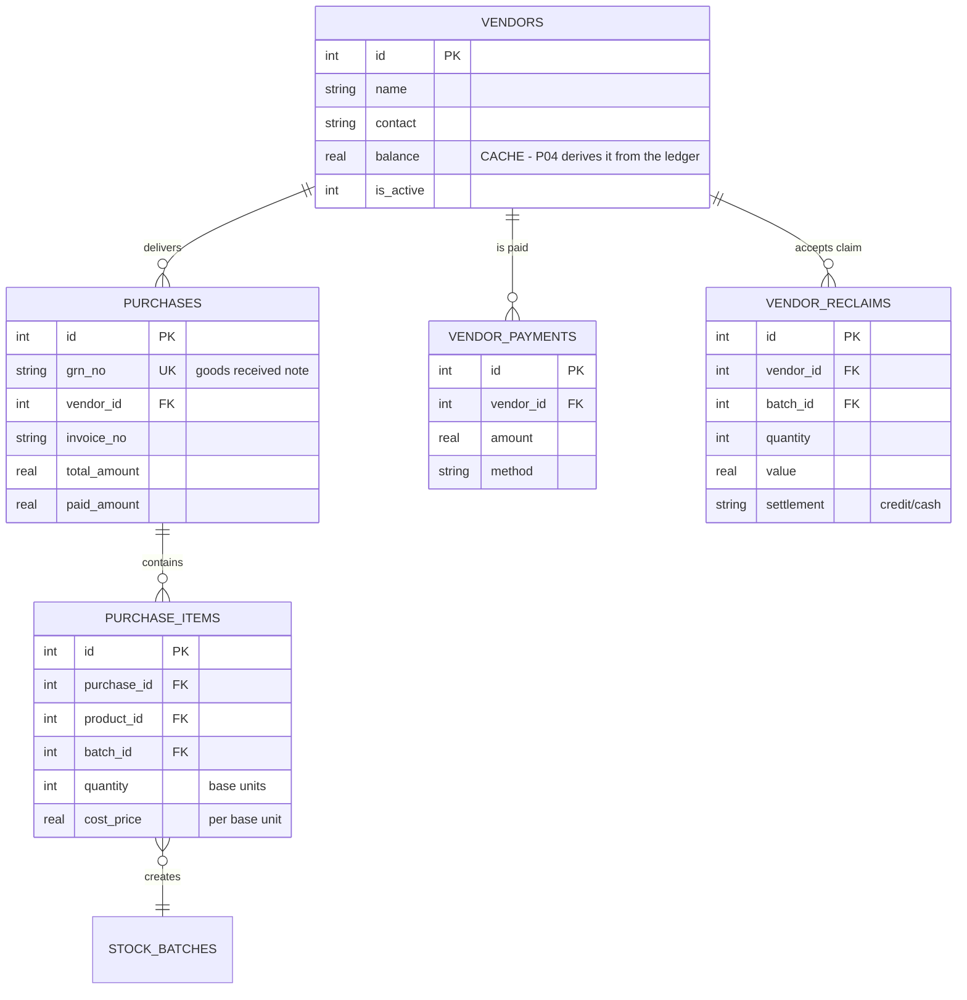
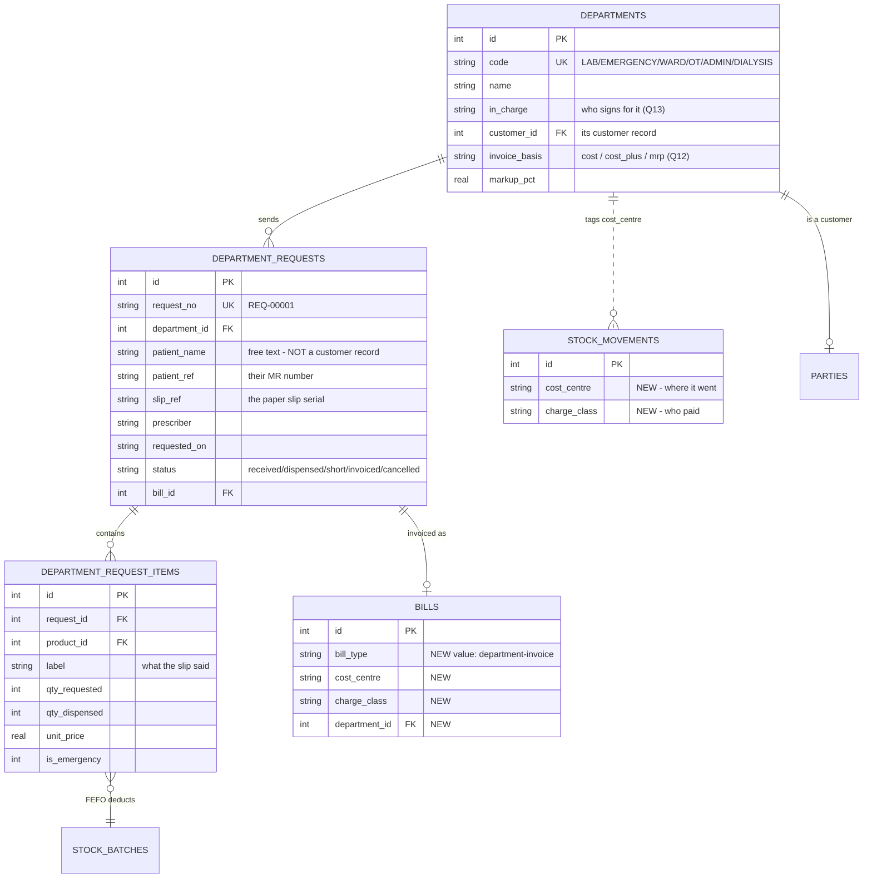
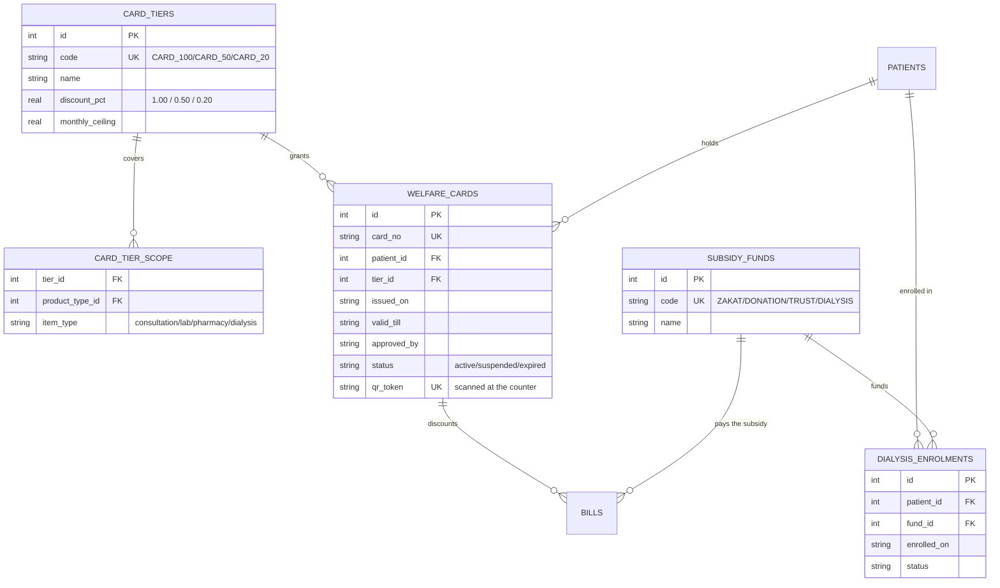
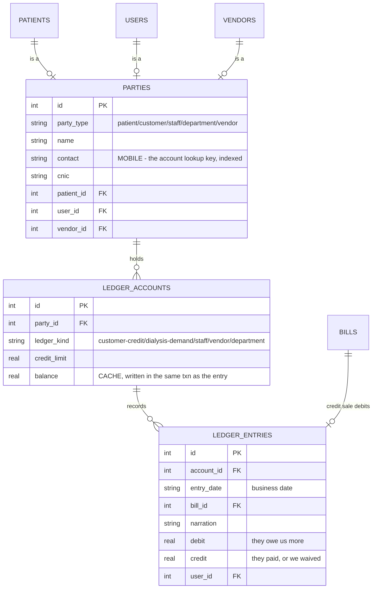
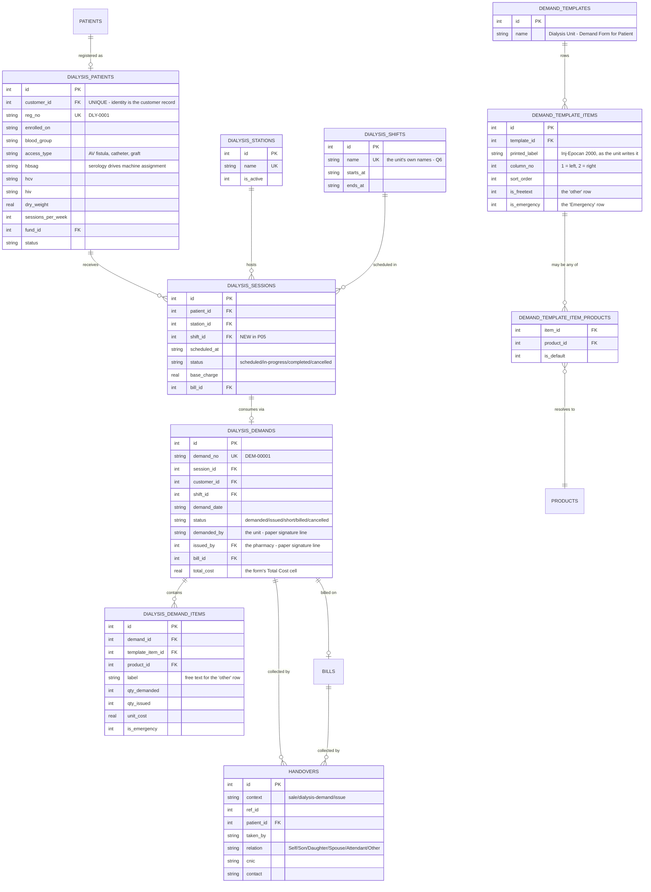
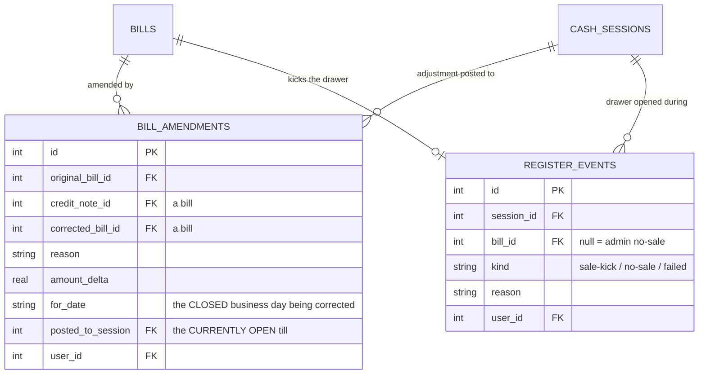

# ERD — entity relationships

The same structure as [DATABASE.md](DATABASE.md), drawn. Split by domain, because one
diagram of forty tables is a picture nobody reads.

> **Viewing:** these are Mermaid diagrams. VS Code renders them in Markdown preview
> (`Ctrl+Shift+V`); GitHub renders them inline.

**Scope:** the product is a **pharmacy POS + dialysis management system** — see
[SCOPE.md](SCOPE.md). Section 4 is on hold and drawn for reference only.

**Legend:** solid entities are shipped. Sections marked 🟦 are planned and name the phase
that adds them.

---

## 1. The system at a glance

How the domains hang together. `bills` is the hub — almost every money question is answered
by joining to it.

---

## 2. Inventory & pharmacy — the core

This is where the current product lives. Note the two facts that govern everything:
`stock_batches.quantity` is in **base units**, and `expiry_date` is the FEFO ordering key.

---

## 3. Billing & money

> **Phase 04 changes one arrow here:** a *credit* bill must **not** post a cash transaction.
> Revenue is recognised at sale, cash at settlement. That dotted line becomes conditional.

---

## 4. Clinical — ⏸️ ON HOLD

> These four modules (Reception, Token & Queue, Consultation/EMR, Laboratory) are **not being
> built** — see [SCOPE.md](SCOPE.md). The tables exist and the code stays behind the mode gate.
> Drawn here so nobody re-creates them.

### 4a. Shape of the on-hold tables

---

## 5. Vendors & purchasing

There is **no purchase order** — the order taker visits and writes the order in his own
book. The system records the delivery.

---

## 6. 🟦 Phase 02 — departments: prescription in, invoice out

The lab, emergency and the wards are **outside** this product — their modules are on hold.
They reach the pharmacy the way any customer does: a prescription comes in, stock goes out,
an invoice goes back, and those invoices are the hospital's expense.

There is deliberately **no link** from a department request to a patient record. The
department's patients belong to the department's own system.

`cost_centre` ∈ `COUNTER` · `DIALYSIS` · `LAB` · `EMERGENCY` · `WARD` · `OT` · `ADMIN`

`charge_class` ∈ `PAID` · `CARD_100` · `CARD_50` · `CARD_20` · `STAFF` · `DIALYSIS_FREE` ·
`DEPARTMENT` · `CREDIT` · `ZAKAT`

Two orthogonal columns, not one enum: *an emergency injection given free to a card patient is
two facts, not one.*

## 7. 🟦 Phase 03 — customers & entitlements

A card is a physical thing with a number, a tier and an expiry that the counter verifies —
not a word typed on a patient record. Dialysis entitlement hangs off an *enrolment*, not off
`patients.category`, because a dialysis patient can still be a paying customer for
unrelated items.

---

## 8. 🟦 Phase 04 — party accounts & customer credit

One ledger spine serves credit, staff recovery, vendor payables and the dialysis demand
account. The `UNIQUE (party_id, ledger_kind)` constraint is what keeps a **dialysis demand
from ever being netted against a patient's personal credit account** — the client was explicit about
that.

---

## 9. Dialysis — shipped, and 🟦 Phase 05

The demand form is **per patient, per shift**. One document is simultaneously the
requisition, the stock issue and the source of that patient's charge — so it is modelled as
one record, not three screens that must be reconciled afterwards.

### The demand form, row by row

Seed `demand_template_items` with exactly this, in this order, so the screen matches the
paper the unit already fills in.

| Sort | Column 1 (left) | Column 2 (right) |
|---|---|---|
| 1 | Inj-Neurobian | Inj-Toralak |
| 2 | Inj-Mabil | Inj-Aron Plus |
| 3 | Inj-Epocan 2000 | Inj-Gentamycin |
| 4 | Inj-Epocan 4000 | Syringe 1cc / 3cc / 10cc ⚠ |
| 5 | Inj-Omeprazole | Gauze |
| 6 | Inj-Antibiotec / Vancare ⚠ | IV set |
| 7 | Inj-Iron | N/S 1000 / 100 ml ⚠ |
| 8 | Inj-Paracetamol | other 🔓 |
| 9 | Inj-Hyzonate | Emergency 🔓🚨 |

⚠ = one printed row covering **several SKUs**; needs a `demand_template_item_products` set
with a default (see [OPEN-QUESTIONS](OPEN-QUESTIONS.md) Q7).
🔓 = `is_freetext` — searches the whole catalogue.
🚨 = `is_emergency` — **already a row on their paper form**, which is why "emergency medicine
on the same dialysis invoice" is not a new feature, just one that was being done by hand.

Header carries **Shift** and **Date**; footer carries **Demanded by** (the unit) and
**Issued by** (the pharmacy) — two signatures, therefore a two-step workflow. Three patient
blocks print to a sheet; keep that so the unit's filing does not change.

---

## 10. 🟦 Phases 06 & 07 — corrections and the drawer

**No bill is ever edited in place.** A correction is a credit note plus a corrected bill,
with the cash adjustment posted to the *currently open* till carrying a `for_date` reference
— so a closed till stays closed and stays reconciled.
